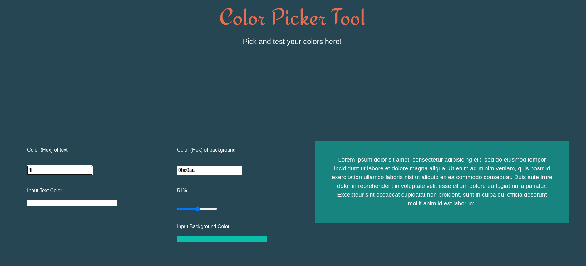

# color-picker-tool

This is a miniproject written in vanilla Javascript (+html, css).  
The aim is to provide a simple tool for the user to adjust text and background colors and opacity.  
  
The user can give hex values for both text and background and he/she can change the opacity.  
  

 
 

